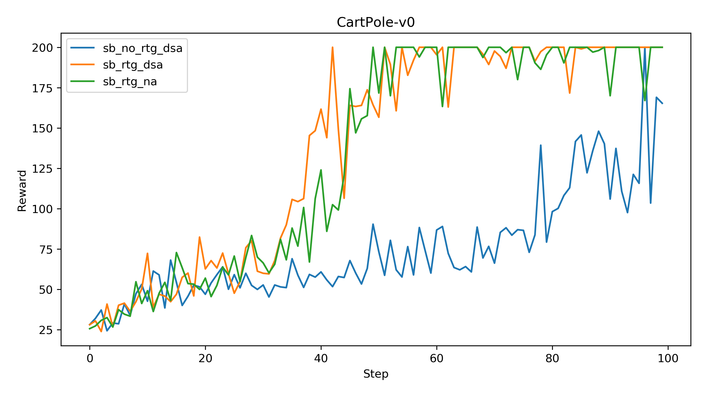
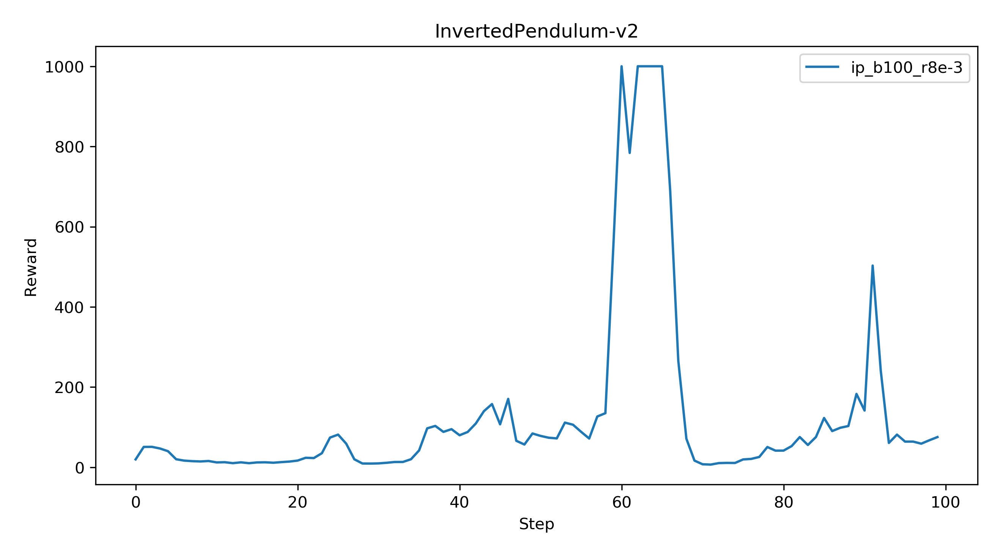
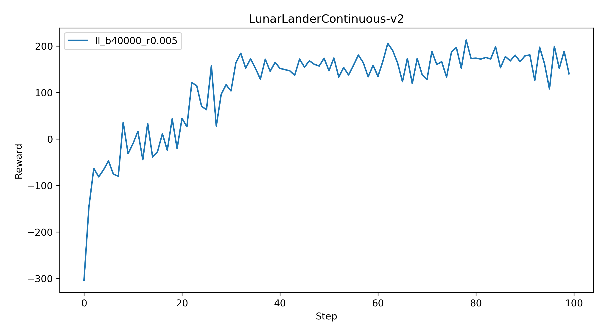
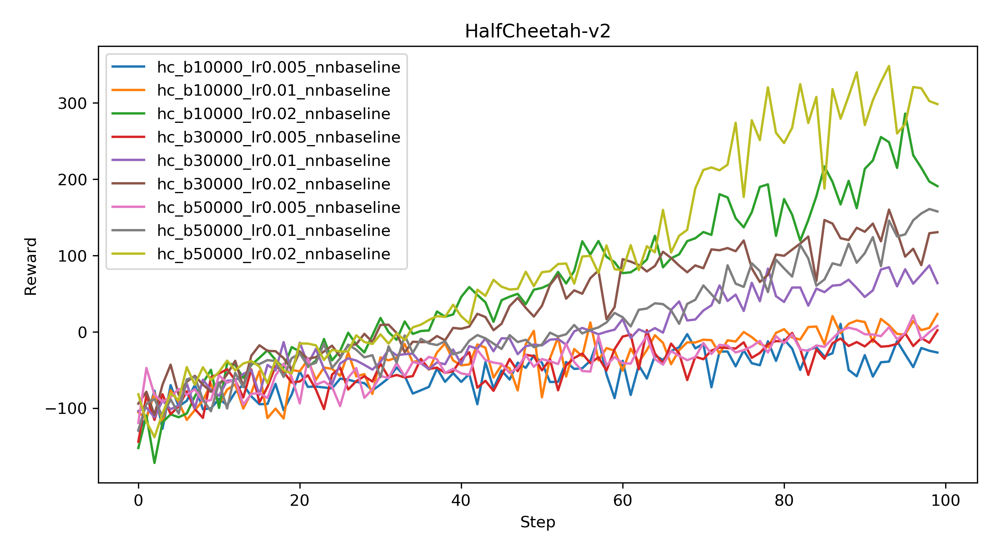
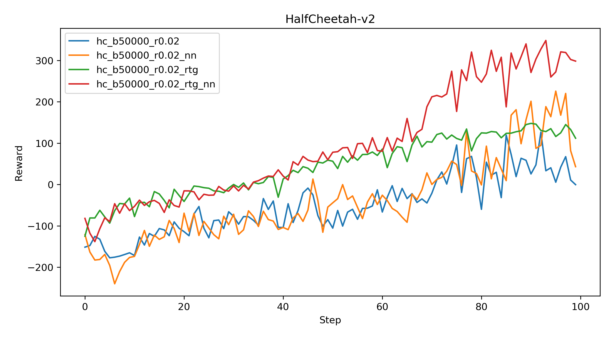

# CartPole

```bash
python cs285/scripts/run_hw2_policy_gradient.py --env_name CartPole-v0 -n 100 -b 1000 -dsa --exp_name sb_no_rtg_dsa -l 1 -s 32
python cs285/scripts/run_hw2_policy_gradient.py --env_name CartPole-v0 -n 100 -b 1000 -rtg -dsa --exp_name sb_rtg_dsa -l 1 -s 32
python cs285/scripts/run_hw2_policy_gradient.py --env_name CartPole-v0 -n 100 -b 1000 -rtg --exp_name sb_rtg_na -l 1 -s 32
python cs285/scripts/run_hw2_policy_gradient.py --env_name CartPole-v0 -n 100 -b 5000 -dsa --exp_name lb_no_rtg_dsa -l 1 -s 32
python cs285/scripts/run_hw2_policy_gradient.py --env_name CartPole-v0 -n 100 -b 5000 -rtg -dsa --exp_name lb_rtg_dsa -l 1 -s 32
python cs285/scripts/run_hw2_policy_gradient.py --env_name CartPole-v0 -n 100 -b 5000 -rtg --exp_name lb_rtg_na -l 1 -s 32
```




Reward-to-go performs better.

Advantage standardization helps reducing variance.

Larger batch size can make learning faster.

# InvertedPendulum

```bash
python cs285/scripts/run_hw2_policy_gradient.py --env_name InvertedPendulum-v2 --ep_len 1000 --discount 0.9 -n 100 -l 2 -s 64 -b 100 -lr 8e-3 -rtg --exp_name ip_b100_r0.008
```



# LunarLander

```bassh
python cs285/scripts/run_hw2_policy_gradient.py --env_name LunarLanderContinuous-v2 --ep_len 1000 --discount 0.99 -n 100 -l 2 -s 64 -b 40000 -lr 0.005 -rtg --nn_baseline --exp_name ll_b40000_r0.005
```



# HalfCheetah

```bash
python cs285/scripts/run_hw2_policy_gradient.py --env_name HalfCheetah-v2 --ep_len 150 --discount 0.95 -n 100 -l 2 -s 32 -b 10000 -lr 0.005 --video_log_freq -1 --reward_to_go --nn_baseline --exp_name hc_b10000_lr0.005_nnbaseline
python cs285/scripts/run_hw2_policy_gradient.py --env_name HalfCheetah-v2 --ep_len 150 --discount 0.95 -n 100 -l 2 -s 32 -b 10000 -lr 0.01 --video_log_freq -1 --reward_to_go --nn_baseline --exp_name hc_b10000_lr0.01_nnbaseline
python cs285/scripts/run_hw2_policy_gradient.py --env_name HalfCheetah-v2 --ep_len 150 --discount 0.95 -n 100 -l 2 -s 32 -b 10000 -lr 0.02 --video_log_freq -1 --reward_to_go --nn_baseline --exp_name hc_b10000_lr0.02_nnbaseline
python cs285/scripts/run_hw2_policy_gradient.py --env_name HalfCheetah-v2 --ep_len 150 --discount 0.95 -n 100 -l 2 -s 32 -b 30000 -lr 0.005 --video_log_freq -1 --reward_to_go --nn_baseline --exp_name hc_b30000_lr0.005_nnbaseline
python cs285/scripts/run_hw2_policy_gradient.py --env_name HalfCheetah-v2 --ep_len 150 --discount 0.95 -n 100 -l 2 -s 32 -b 30000 -lr 0.01 --video_log_freq -1 --reward_to_go --nn_baseline --exp_name hc_b30000_lr0.01_nnbaseline
python cs285/scripts/run_hw2_policy_gradient.py --env_name HalfCheetah-v2 --ep_len 150 --discount 0.95 -n 100 -l 2 -s 32 -b 30000 -lr 0.02 --video_log_freq -1 --reward_to_go --nn_baseline --exp_name hc_b30000_lr0.02_nnbaseline
python cs285/scripts/run_hw2_policy_gradient.py --env_name HalfCheetah-v2 --ep_len 150 --discount 0.95 -n 100 -l 2 -s 32 -b 50000 -lr 0.005 --video_log_freq -1 --reward_to_go --nn_baseline --exp_name hc_b50000_lr0.005_nnbaseline
python cs285/scripts/run_hw2_policy_gradient.py --env_name HalfCheetah-v2 --ep_len 150 --discount 0.95 -n 100 -l 2 -s 32 -b 50000 -lr 0.01 --video_log_freq -1 --reward_to_go --nn_baseline --exp_name hc_b50000_lr0.01_nnbaseline
python cs285/scripts/run_hw2_policy_gradient.py --env_name HalfCheetah-v2 --ep_len 150 --discount 0.95 -n 100 -l 2 -s 32 -b 50000 -lr 0.02 --video_log_freq -1 --reward_to_go --nn_baseline --exp_name hc_b50000_lr0.02_nnbaseline
```



Increasing the learning rate can boost the learning process.

Increasing the batch size can get better performance.

```bash
python cs285/scripts/run_hw2_policy_gradient.py --env_name HalfCheetah-v2 --ep_len 150 --discount 0.95 -n 100 -l 2 -s 32 -b 50000 -lr 0.02 --exp_name hc_b50000_r0.02
python cs285/scripts/run_hw2_policy_gradient.py --env_name HalfCheetah-v2 --ep_len 150 --discount 0.95 -n 100 -l 2 -s 32 -b 50000 -lr 0.02 -rtg --exp_name hc_b50000_r0.02
python cs285/scripts/run_hw2_policy_gradient.py --env_name HalfCheetah-v2 --ep_len 150 --discount 0.95 -n 100 -l 2 -s 32 -b 50000 -lr 0.02 --nn_baseline --exp_name hc_b50000_r0.02
python cs285/scripts/run_hw2_policy_gradient.py --env_name HalfCheetah-v2 --ep_len 150 --discount 0.95 -n 100 -l 2 -s 32 -b 50000 -lr 0.02 -rtg --nn_baseline --exp_name hc_b50000_r0.02
```


