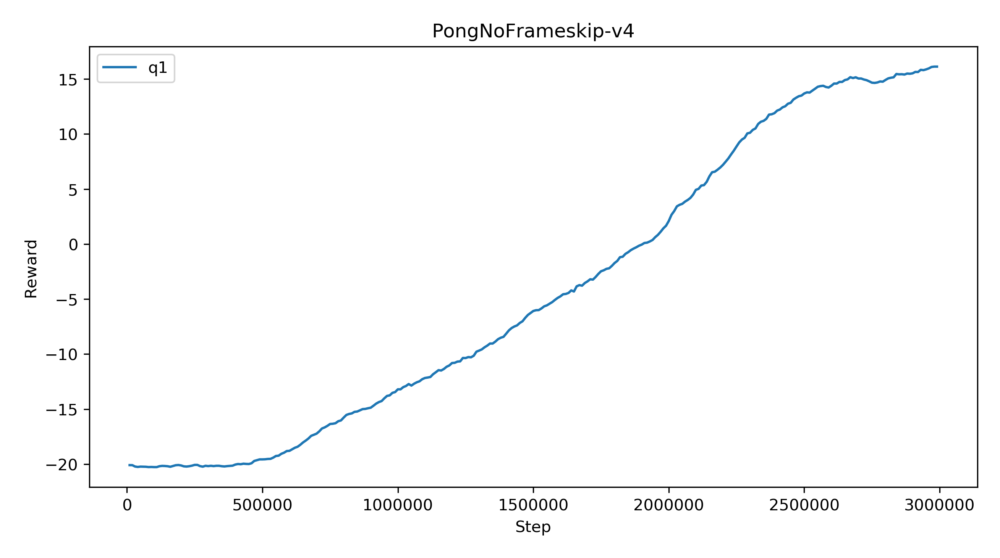
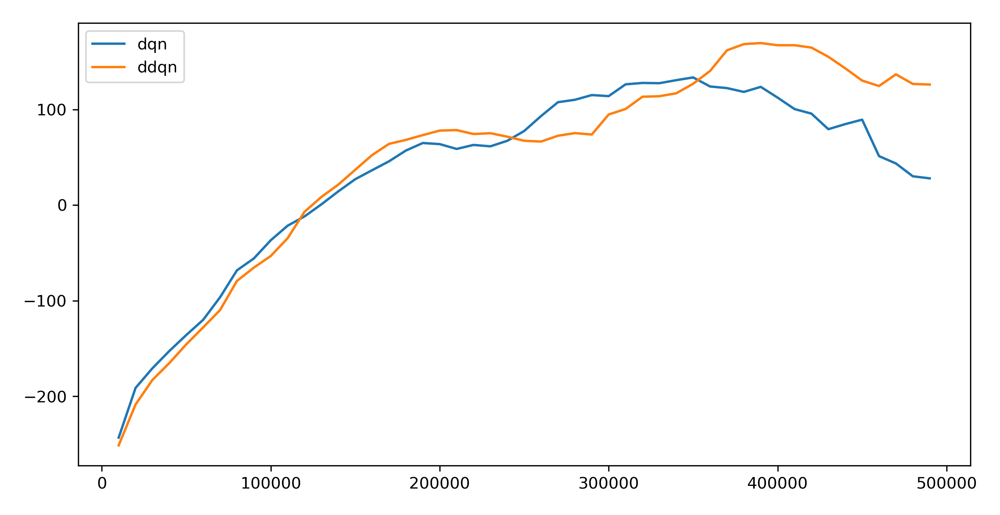
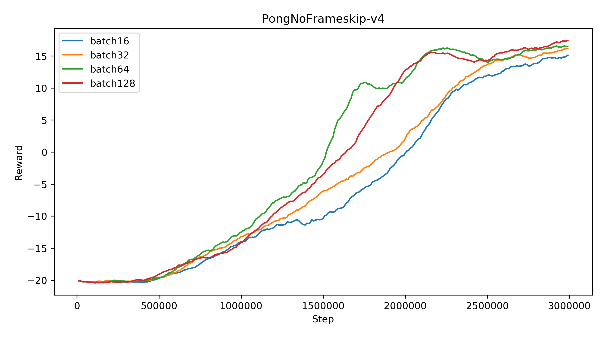
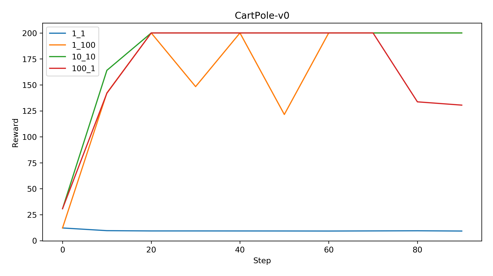
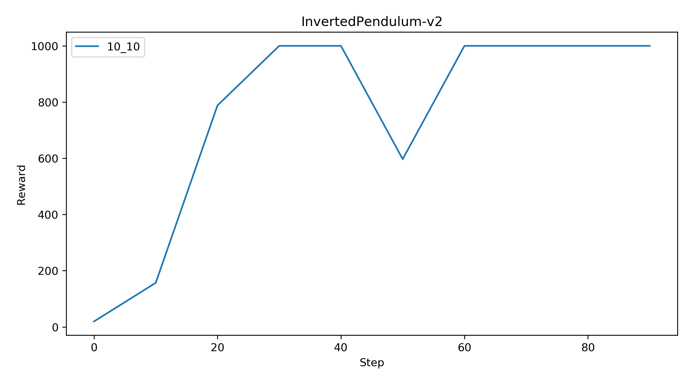
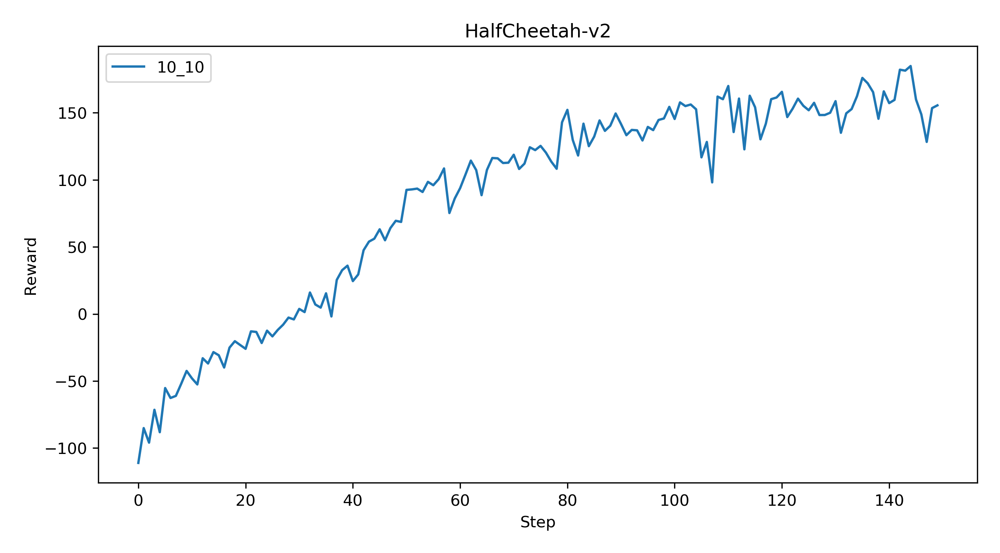

# Q-Learning

## DQN

```bash
python cs285/scripts/run_hw3_dqn.py --env_name PongNoFrameskip-v4 --exp_name q1 -gpu
```



## DDQN

```bash
python cs285/scripts/run_hw3_dqn.py --env_name LunarLander-v2 --exp_name q2_dqn_1 --seed 1
python cs285/scripts/run_hw3_dqn.py --env_name LunarLander-v2 --exp_name q2_dqn_2 --seed 2
python cs285/scripts/run_hw3_dqn.py --env_name LunarLander-v2 --exp_name q2_dqn_3 --seed 3

python cs285/scripts/run_hw3_dqn.py --env_name LunarLander-v2 --exp_name q2_doubledqn_1 --double_q --seed 1
python cs285/scripts/run_hw3_dqn.py --env_name LunarLander-v2 --exp_name q2_doubledqn_2 --double_q --seed 2
python cs285/scripts/run_hw3_dqn.py --env_name LunarLander-v2 --exp_name q2_doubledqn_3 --double_q --seed 3
```


## Hyperparameters

```bash
python cs285/scripts/run_hw3_dqn.py --env_name PongNoFrameskip-v4 --exp_name q3_batch16 --batch_size 16 -gpu
python cs285/scripts/run_hw3_dqn.py --env_name PongNoFrameskip-v4 --exp_name q3_batch64 --batch_size 64 -gpu
python cs285/scripts/run_hw3_dqn.py --env_name PongNoFrameskip-v4 --exp_name q3_batch128 --batch_size 128 -gpu
```



Increasing the batch size can get higher reward with same steps in the beginning. 

# Actor-Critic

## Cartpole

```bash
python cs285/scripts/run_hw3_actor_critic.py --env_name CartPole-v0 -n 100 -b 1000 --exp_name 1_1 -ntu 1 -ngsptu 1
python cs285/scripts/run_hw3_actor_critic.py --env_name CartPole-v0 -n 100 -b 1000 --exp_name 100_1 -ntu 100 -ngsptu 1
python cs285/scripts/run_hw3_actor_critic.py --env_name CartPole-v0 -n 100 -b 1000 --exp_name 1_100 -ntu 1 -ngsptu 100
python cs285/scripts/run_hw3_actor_critic.py --env_name CartPole-v0 -n 100 -b 1000 --exp_name 10_10 -ntu 10 -ngsptu 10
```



The experiment with 10 target updates and 10 gradient update steps for the critic works the best.

## More difficult tasks

```bash
python cs285/scripts/run_hw3_actor_critic.py --env_name InvertedPendulum-v2 --ep_len 1000 --discount 0.95 -n 100 -l 2 -s 64 -b 5000 -lr 0.01 --exp_name 10_10 -ntu 10 -ngsptu 10
python cs285/scripts/run_hw3_actor_critic.py --env_name HalfCheetah-v2 --ep_len 150 --discount 0.90 --scalar_log_freq 1 -n 150 -l 2 -s 32 -b 30000 -eb 1500 -lr 0.02 --exp_name 10_10 -ntu 10 -ngsptu 10
```



